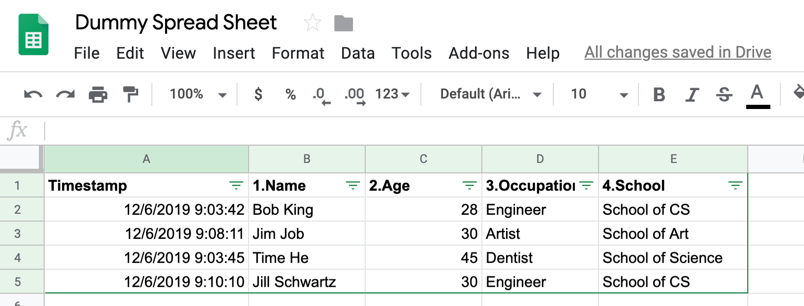
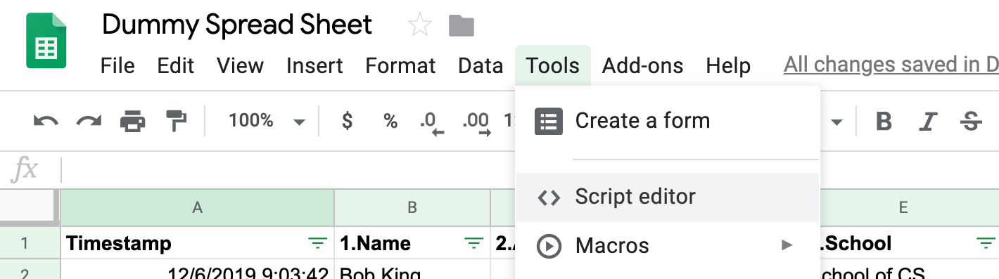
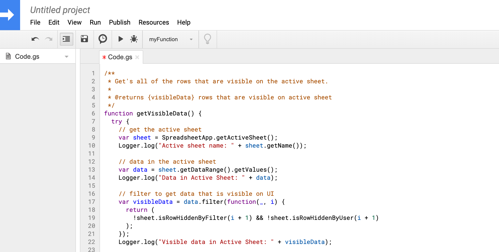
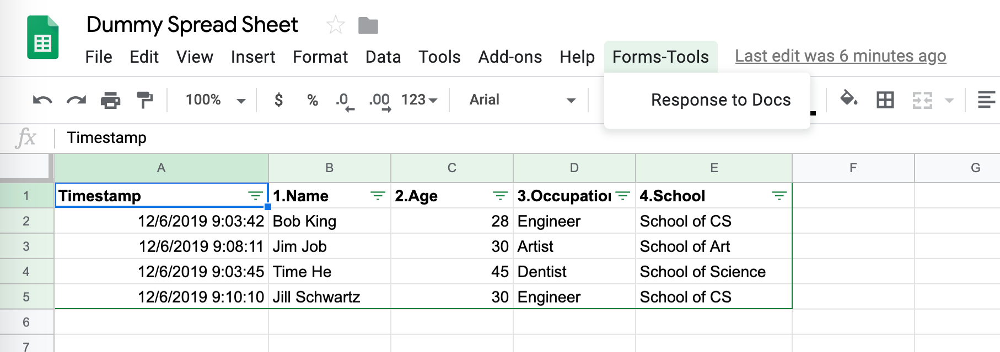
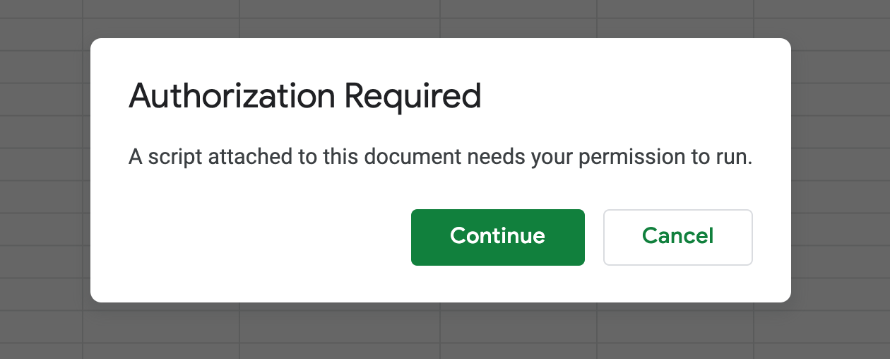
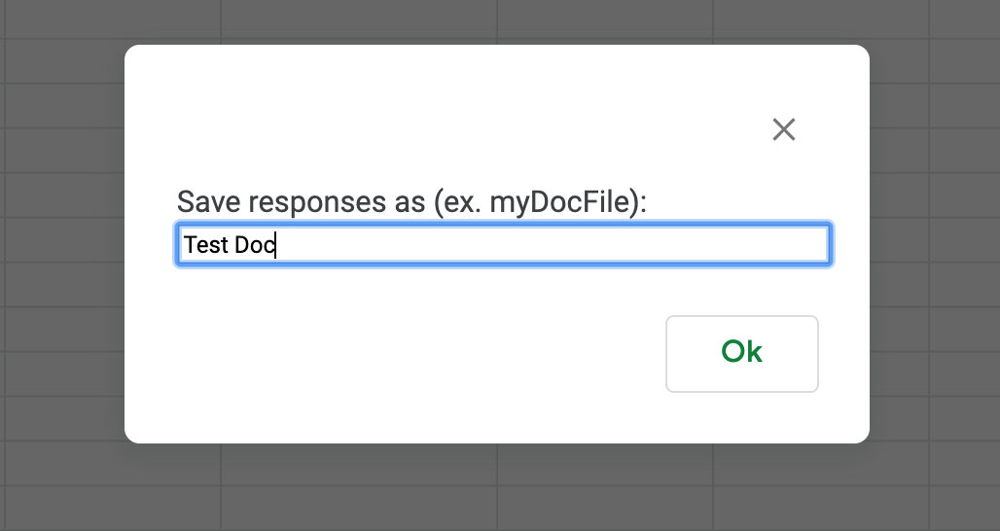
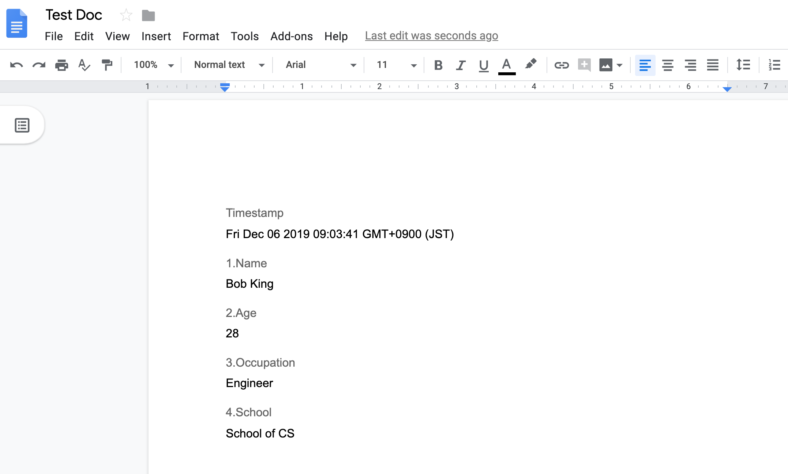

Google Forms Reponses To Docs
================================

Spreadsheet data containing Google Forms Responses becomes difficult to read if there are a large number of columns. 
This script essentially transposes the data stored on Google Spreadsheets and stores it on a Google Doc, which is more legible.

Installation
===================================
### Note

* This installation is pretty manual since I never bothered to publish this on Google Chrome Store. 

### Steps
1. Copy the contents of [src/app.gs](https://github.com/shusinthebox/Google-Forms-Responses-To-Docs/blob/master/src/app.gs) to your clipboard.
2. Launch the Google Spreadsheet you are interested in.

3. Launch Script editor from the Tools dropdown.

4. Paste the script contents and save.

5. Refresh the Spreadsheet and you're done!

Usage
=====================================
### Note 

* You'll need to authorize the script on your first usage.

* For large spreadsheets (>300 rows), please split the data across multiple sheets. The script may potentially crash if the data size is large.

### Steps

1. Run the script by selecting "Response to Docs".
2. Enter to the file name for the doc you are saving your data to.

3. Your doc is now saved under your local drive. 

